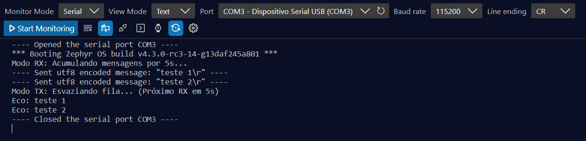
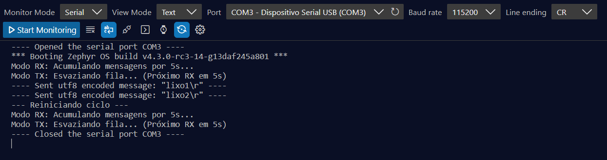
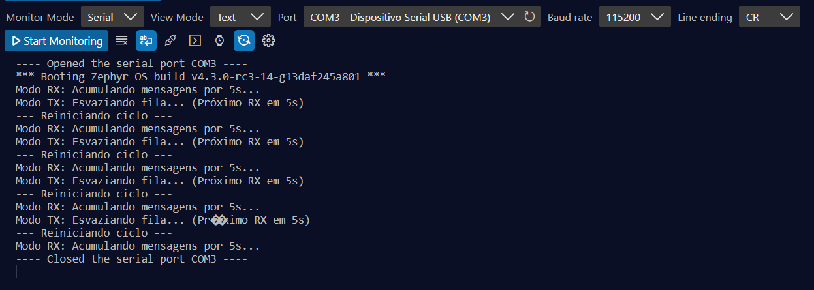
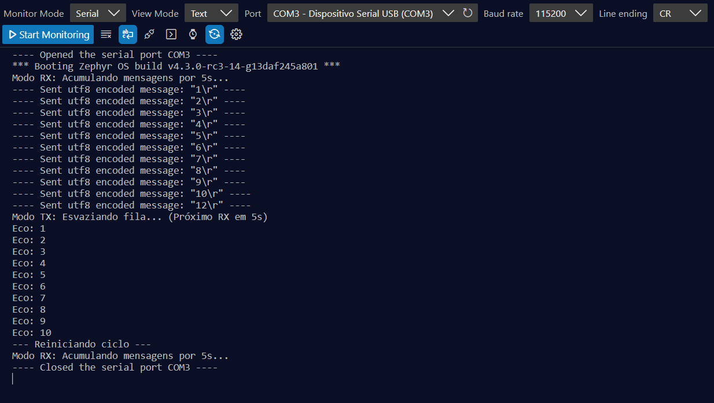
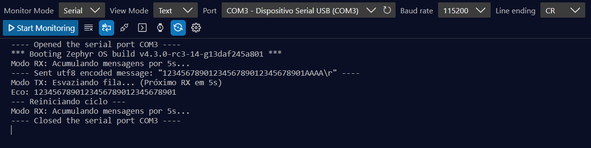
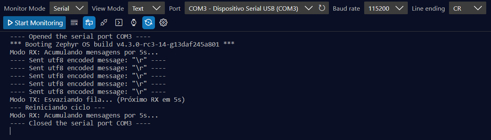

# PSI-Microcontroladores2-Aula10
Atividade: Comunicação UART

# Projeto UART – Atividade em Duplas (Echo Bot + Async API)

## 1. Informações Gerais

* Dupla:

  * Filipe Cassoli - 5806752
  * Henrique Santiago - 16872729

* Objetivo: implementar, testar e documentar aplicações de comunicação UART baseadas nos exemplos oficiais “echo_bot” e “async_api”, utilizando desenvolvimento orientado a testes, diagramas de sequência D2 e registro de evidências.

---

# 2. Estrutura Esperada do Repositório

```
README.md
src/

docs/
  evidence/
  sequence-diagrams/

```

---

# 3. Etapa 1 – Echo Bot (UART Polling/Interrupt)

---

## 3.1 Descrição do Funcionamento

Descrever aqui de forma textual o comportamento esperado baseado no exemplo oficial.
Link usado como referência:
[https://docs.zephyrproject.org/latest/samples/drivers/uart/echo_bot/README.html](https://docs.zephyrproject.org/latest/samples/drivers/uart/echo_bot/README.html)

---

### **Descrição do Comportamento Esperado – UART Echo Bot**

O *UART Echo Bot* é um exemplo simples que demonstra o uso do driver UART para comunicação serial. O programa atua como um “bot” que recebe dados digitados pelo usuário via console UART e devolve exatamente o mesmo conteúdo após o usuário pressionar a tecla *Enter*.


### **Visão Geral do Comportamento**

O programa inicializa a UART padrão do Zephyr (geralmente a mesma usada pelo console/shell) e passa a funcionar como um **bot de eco via serial**.
Ele aguarda o usuário digitar uma linha de texto (finalizada com *Enter*), e então envia de volta a mesma linha, precedida da palavra **“Echo:”**.

Durante o funcionamento:

* A **recepção** dos caracteres ocorre **de forma assíncrona**, via **interrupções**.
* O **envio** da resposta é feito **por polling** (síncrono), caractere a caractere.
* O programa fica rodando indefinidamente, repetindo o ciclo de leitura → eco → espera por nova entrada.


### **Fluxo de Execução Esperado**

#### **1 - Inicialização**

1. O código obtém o *device handle* da UART configurada como `zephyr_shell_uart` no *Device Tree*.
2. Ele verifica se o dispositivo está pronto com `device_is_ready()`.

   * Se não estiver, exibe a mensagem de erro:

     ```
     UART device not found!
     ```
3. Configura a UART para operação **interrompida**, registrando a função `serial_cb` como *callback* para tratar os dados recebidos.
4. Habilita a recepção por interrupção (`uart_irq_rx_enable()`).
5. Envia duas mensagens de boas-vindas pela UART:

   ```
   Hello! I'm your echo bot.
   Tell me something and press enter:
   ```


#### **2 - Recepção de dados (Interrupção via `serial_cb`)**

A função `serial_cb()` é chamada automaticamente sempre que a UART recebe dados.

Comportamento detalhado:

* Lê cada caractere recebido via `uart_fifo_read()`.
* Armazena os caracteres no buffer `rx_buf[]`.
* Quando detecta um *fim de linha* (`\n` ou `\r`), considera que a mensagem terminou:

  * Adiciona um terminador nulo (`\0`) ao final da string.
  * Copia a linha completa para a **fila de mensagens (`k_msgq`)**.
  * Zera o índice do buffer (`rx_buf_pos = 0`) para começar a próxima linha.
* Se o buffer encher antes do *Enter*, os caracteres excedentes são descartados.
* Se a fila estiver cheia (10 mensagens pendentes), novas mensagens são descartadas silenciosamente.


#### **3 - Fila de mensagens (`k_msgq`)**

A `k_msgq` é uma fila do Zephyr usada para comunicação entre a *interrupt callback* e a *thread principal* (`main()`).

* Capacidade: **10 mensagens**
* Tamanho de cada mensagem: **32 bytes**
* Alinhamento: **4 bytes**

Ela permite que a função principal espere por mensagens novas **sem bloquear o recebimento de interrupções**.


#### **4 - Loop principal (`main`)**

A função `main()` entra em um loop infinito:

```c
while (k_msgq_get(&uart_msgq, &tx_buf, K_FOREVER) == 0) {
    print_uart("Echo: ");
    print_uart(tx_buf);
    print_uart("\r\n");
}
```

Comportamento esperado:

1. O código aguarda indefinidamente (`K_FOREVER`) por uma nova linha de texto na fila (`uart_msgq`).
2. Quando uma linha chega:

   * Escreve `"Echo: "`
   * Escreve a linha recebida (`tx_buf`)
   * Finaliza com quebra de linha `\r\n`
3. Repete o ciclo para a próxima entrada.


#### **5 - Envio de dados (`print_uart`)**

A função `print_uart()` envia cada caractere da string informada usando `uart_poll_out()` — um método **bloqueante**, mas simples.

Ela é usada:

* Para exibir as mensagens de boas-vindas
* Para enviar o eco de volta ao usuário


### **Exemplo de Interação Esperada (via terminal serial)**

```
Hello! I'm your echo bot.
Tell me something and press enter:
Type e.g. "Hi there!" and hit enter!
```

Usuário digita:

```
Hi there!
```

Bot responde:

```
Echo: Hi there!
```

Usuário digita outra linha:

```
Zephyr is cool
```

Bot responde:

```
Echo: Zephyr is cool
```

O ciclo continua indefinidamente.


### **Tratamento de Casos Especiais**

| Situação                            | Comportamento esperado                        |
| ----------------------------------- | --------------------------------------------- |
| Linha muito longa (> 31 caracteres) | Caracteres excedentes são descartados         |
| Linha vazia (apenas *Enter*)        | Gera eco: `Echo:`                             |
| Fila cheia (10 mensagens pendentes) | Mensagens novas são ignoradas                 |
| UART não pronta                     | Mensagem de erro no console e fim da execução |
| Erro ao configurar interrupção      | Exibe mensagem explicativa e encerra          |


### **Resumo funcional**

| Função         | Papel                                                         |
| -------------- | ------------------------------------------------------------- |
| `serial_cb()`  | ISR da UART: lê caracteres e envia mensagens completas à fila |
| `print_uart()` | Envia texto para o terminal, caractere a caractere            |
| `main()`       | Inicializa UART, exibe mensagens e ecoa entrada recebida      |

---

## **3.2 Casos de Teste Planejados (TDD)** – *UART Echo Bot (Zephyr)*


### **CT1 – Eco básico**

| Item                       | Descrição                                                                                                                                                                                      |
| -------------------------- | ---------------------------------------------------------------------------------------------------------------------------------------------------------------------------------------------- |
| **Entrada:**               | Usuário digita `Hello` e pressiona *Enter* (`\r` ou `\n`).                                                                                                                                     |
| **Saída esperada:**        | `Echo: Hello`                                                                                                                                                                                  |
| **Critério de Aceitação:** | O texto deve ser ecoado exatamente como digitado, com o prefixo “Echo: ” e apenas após o *Enter* ser recebido (fim da linha detectado). O sistema deve permanecer pronto para próxima entrada. |


### **CT2 – Linha vazia**

| Item                       | Descrição                                                                                                                                                           |
| -------------------------- | ------------------------------------------------------------------------------------------------------------------------------------------------------------------- |
| **Entrada:**               | Usuário pressiona *Enter* sem digitar nenhum caractere.                                                                                                             |
| **Saída esperada:**        | `Echo:` *(linha vazia após o prefixo)*                                                                                                                              |
| **Critério de Aceitação:** | O sistema não deve travar nem gerar erro. Deve ecoar uma linha vazia, demonstrando que o *callback* e a fila (`k_msgq`) tratam corretamente mensagens sem conteúdo. |


### **CT3 – Linha longa (acima de 31 caracteres)**

| Item                       | Descrição                                                                                                                                      |
| -------------------------- | ---------------------------------------------------------------------------------------------------------------------------------------------- |
| **Entrada:**               | Usuário digita uma linha com mais de 31 caracteres e pressiona *Enter*.                                                                        |
| **Saída esperada:**        | Apenas os primeiros 31 caracteres são ecoados (restante truncado). Exemplo: `Echo: <primeiros 31 caracteres>`                                  |
| **Critério de Aceitação:** | O sistema deve descartar caracteres excedentes sem travar, conforme lógica `rx_buf_pos < sizeof(rx_buf)-1`. Nenhum erro ou reset deve ocorrer. |


### **CT4 – Caracteres especiais**

| Item                       | Descrição                                                                                                             |
| -------------------------- | --------------------------------------------------------------------------------------------------------------------- |
| **Entrada:**               | Usuário digita: `!@#$%&*()_+-=[]{};:'",.<>/?\|` e pressiona *Enter*.                                                  |
| **Saída esperada:**        | `Echo: !@#$%&*()_+-=[]{};:'",.<>/?\|`                                                                                 |
| **Critério de Aceitação:** | Todos os caracteres devem ser transmitidos e recebidos sem alteração. Nenhum símbolo deve ser perdido ou substituído. |


### **CT5 – Caracteres não ASCII (UTF-8)**

| Item                       | Descrição                                                                                                                                                                |
| -------------------------- | ------------------------------------------------------------------------------------------------------------------------------------------------------------------------ |
| **Entrada:**               | Usuário digita `Olá, você está bem? äöüñç` e pressiona *Enter*.                                                                                                          |
| **Saída esperada:**        | `Echo: Olá, você está bem? äöüñç` *(ou comportamento definido caso UART não suporte UTF-8)*                                                                              |
| **Critério de Aceitação:** | Se o hardware/UART suportar UTF-8, os caracteres devem ser ecoados corretamente. Caso contrário, caracteres multibyte podem ser omitidos, mas o sistema não deve travar. |


### **CT6 – Múltiplas linhas seguidas**

| Item                       | Descrição                                                                                                                             |
| -------------------------- | ------------------------------------------------------------------------------------------------------------------------------------- |
| **Entrada:**               | Usuário envia diversas linhas consecutivas: `A` + Enter, `B` + Enter, `C` + Enter, etc.                                               |
| **Saída esperada:**        | Cada linha é ecoada individualmente, ex.: `Echo: A`, `Echo: B`, `Echo: C`...                                                          |
| **Critério de Aceitação:** | O sistema deve processar todas as mensagens na ordem correta, sem perder ou misturar linhas. A fila `k_msgq` deve manter a sequência. |


### **CT7 – Alta taxa de entrada de caracteres**

| Item                       | Descrição                                                                                                                                                                                                                                   |
| -------------------------- | ------------------------------------------------------------------------------------------------------------------------------------------------------------------------------------------------------------------------------------------- |
| **Entrada:**               | Script envia várias linhas rapidamente, com pouco tempo entre elas.                                                                                                                                                                         |
| **Saída esperada:**        | Cada linha deve ser ecoada corretamente, mesmo em alta taxa de transmissão.                                                                                                                                                                 |
| **Critério de Aceitação:** | O ISR (`serial_cb`) deve conseguir lidar com o fluxo sem perda de dados. Caso a fila (`k_msgq`) encha (10 mensagens), o programa deve continuar funcional e descartar silenciosamente mensagens excedentes. Nenhum travamento deve ocorrer. |


### **CT8 – Reset durante digitação**

| Item                       | Descrição                                                                                                                                              |
| -------------------------- | ------------------------------------------------------------------------------------------------------------------------------------------------------ |
| **Entrada:**               | Usuário digita parte de uma mensagem, sem pressionar *Enter*, e o dispositivo é reiniciado.                                                            |
| **Saída esperada:**        | Após reiniciar, o sistema exibe novamente as mensagens iniciais:                                                                                       |
|                            | `Hello! I'm your echo bot.`<br>`Tell me something and press enter:`                                                                                    |
| **Critério de Aceitação:** | O buffer de recepção (`rx_buf_pos`) deve ser reiniciado. Nenhum dado parcial anterior deve ser ecoado. O sistema deve voltar ao estado inicial normal. |


### **Resumo**

| Categoria            | Casos                   |
| -------------------- | ----------------------- |
| Funcionamento normal | CT1, CT2, CT3, CT4, CT6 |
| Robustez e limites   | CT5, CT7, CT10          |
| Resiliência e erro   | CT8                     |

---

## 3.3 Implementação

Não foi realizada nenhuma alteração no código-fonte do *Echo Bot UART*, já que o exemplo utilizado faz parte dos **samples oficiais do Zephyr Project** e já vem pronto para uso. A implementação foi executada exatamente conforme disponibilizada em `samples/drivers/uart/echo_bot`.

Em vez de executar o código pelo PlatformIO no VSCode, seguiu-se o procedimento oficial descrito no tutorial **“Getting Started Guide”** da documentação do Zephyr.
Esse guia fornece as instruções necessárias para **instalar o ambiente de desenvolvimento, configurar o SDK e o gerenciador de builds (west)**, bem como **compilar, gravar e executar aplicações de exemplo em placas de desenvolvimento compatíveis**, como a **FRDM-KL25Z**.


### **Etapas do processo (baseadas no Getting Started Guide)**

1. **Configuração do ambiente:**

   * Foi configurado um ambiente de desenvolvimento Python virtual (`.venv`) dentro da pasta `zephyrproject`, utilizando:

     ```powershell
     python -m venv zephyrproject\.venv
     zephyrproject\.venv\Scripts\Activate.ps1
     ```
   * Com o ambiente ativo, instalou-se o gerenciador de projetos Zephyr:

     ```powershell
     pip install west
     ```

2. **Obtenção do código-fonte do Zephyr:**

   * O Zephyr foi inicializado e clonado com seus módulos:

     ```powershell
     west init zephyrproject
     cd zephyrproject
     west update
     west zephyr-export
     ```
   * Foram instaladas as dependências Python do Zephyr:

     ```powershell
     west packages pip --install
     ```

3. **Instalação do SDK:**

   * O Zephyr SDK foi instalado usando o próprio comando do *west*, que inclui as toolchains necessárias (compilador, assembler e linker):

     ```powershell
     cd zephyr
     west sdk install
     ```

4. **Compilação do exemplo Echo Bot:**

   * O projeto foi compilado para a placa **FRDM-KL25Z**, utilizando o comando:

     ```powershell
     west build -p always -b frdm_kl25z samples/drivers/uart/echo_bot
     ```
   * O parâmetro `-p always` força uma compilação limpa (*pristine build*), garantindo que não haja resíduos de builds anteriores.

5. **Gravação (flash) do firmware:**

   * Com a placa conectada via USB e o **LinkServer** instalado, o código foi gravado na placa:

     ```powershell
     west flash
     ```
   * Esse processo compila o binário, identifica automaticamente a interface de programação e transfere o firmware para a placa.

6. **Execução e monitoramento serial:**

   * Após o upload, o dispositivo inicia automaticamente e exibe a mensagem de boas-vindas:

     ```
     Hello! I'm your echo bot.
     Tell me something and press enter:
     ```

   * A comunicação UART foi então monitorada por meio do um terminal serial do VSCode, configurado com:

     * Porta: COM3
     * Baud rate: 115200 bps
     * 8 data bits, sem paridade, 1 stop bit (8N1)

   * Ao enviar qualquer texto seguido de **Enter**, o dispositivo responde com o eco:

     ```
     Echo: <mensagem digitada>
     ```


### **Resumo do comportamento**

O *Echo Bot UART* utiliza a API de interrupção da UART para **receber dados de forma assíncrona** e a API de polling para **enviar os dados de volta ao console**.
Cada linha digitada e finalizada com *Enter* é armazenada em uma fila (`k_msgq`) e posteriormente reenviada pelo firmware, simulando o comportamento de um "bot" que repete o que o usuário digita.


### **Conclusão**

O exemplo foi executado com sucesso seguindo o procedimento do **Getting Started Guide**, sem necessidade de alterações no código.
O processo demonstrou corretamente o funcionamento da comunicação UART no Zephyr, com envio e recepção de mensagens de texto através da placa FRDM-KL25Z.

---

## 3.4 Evidências de Funcionamento

Todas as evidências disponíveis em [docs/evidence/etapa1_echobot_uart_pollingInterrupt/](docs/evidence/etapa1_echobot_uart_pollingInterrupt/).

---

### Evidências CT1 – Eco básico


[Link para log CT1 – Eco básico](docs/evidence/etapa1_echobot_uart_pollingInterrupt/ct1_eco_básico/log_ct1.txt)

---

### Evidências CT2 – Linha vazia


[Link para log CT2 – Linha vazia](docs/evidence/etapa1_echobot_uart_pollingInterrupt/ct2_linha_vazia/log_ct2.txt)

---

### Evidências CT3 – Linha longa (acima de 31 caracteres)


[Link para log CT3 – Linha longa (acima de 31 caracteres)](docs/evidence/etapa1_echobot_uart_pollingInterrupt/ct3_linha_longa_acima_de_31_caracteres/log_ct3.txt)

---

### Evidências CT4 – Caracteres especiais


[Link para log CT4 – Caracteres especiais](docs/evidence/etapa1_echobot_uart_pollingInterrupt/ct4_caracteres_especiais/log_ct4.txt)

---

### Evidências CT5 – Caracteres não ASCII (UTF-8)


[Link para log CT5 – Caracteres não ASCII (UTF-8)](docs/evidence/etapa1_echobot_uart_pollingInterrupt/ct5_caracteres_nao_ascii_utf_8/log_ct5.txt)

---

### Evidências CT6 – Múltiplas linhas seguidas


[Link para log CT6 – Múltiplas linhas seguidas](docs/evidence/etapa1_echobot_uart_pollingInterrupt/ct6_multiplas_linhas_seguidas/log_ct6.txt)

---

### Evidências CT7 – Alta taxa de entrada de caracteres


[Link para script python utilizado para alta taxa de entrada](docs/evidence/etapa1_echobot_uart_pollingInterrupt/ct7_alta_taxa_de_entrada_de_caracteres/script_ct7.py)

[Link para log CT7 – Alta taxa de entrada de caracteres](docs/evidence/etapa1_echobot_uart_pollingInterrupt/ct7_alta_taxa_de_entrada_de_caracteres/log_ct7.txt)

---

### Evidências CT8 – Reset durante digitação


[Link para log CT8 – Reset durante digitação](docs/evidence/etapa1_echobot_uart_pollingInterrupt/ct8_reset_durante_digitacao/log_ct8.txt)

---

## 3.5 Diagramas de Sequência D2

Diagrama completo e código base disponíveis em [docs/sequence-diagrams/etapa1_echobot_uart_pollingInterrupt/](docs/sequence-diagrams/etapa1_echobot_uart_pollingInterrupt/)

### **Código base D2**

```
shape: sequence_diagram

# Echo Bot UART - Diagrama de Sequência

App -> UART_Driver: "uart_irq_callback_user_data_set(serial_cb)"
UART_Driver -> UART_Hardware: "Registra callback de interrupção"

App -> UART_Driver: "uart_irq_rx_enable()"
UART_Driver -> UART_Hardware: "Habilita RX"

App -> UART_Hardware: "print_uart('Hello! I\\'m your echo bot.')"
App -> UART_Hardware: "print_uart('Tell me something and press enter:')"

loop "aguarda entrada do usuário"
    UART_Hardware -> UART_Driver: "caracteres recebidos via IRQ"
    UART_Driver -> UART_Driver: "serial_cb() processa cada caractere"
    alt "fim de linha detectado (\\r ou \\n)"
        UART_Driver -> k_msgq: "k_msgq_put(rx_buf)"
        k_msgq -> App: "linha pronta para eco"
        App -> UART_Hardware: "print_uart('Echo: ')"
        App -> UART_Hardware: "print_uart(linha)"
        App -> UART_Hardware: "print_uart('\\r\\n')"
    else "linha não finalizada"
        UART_Driver -> UART_Driver: "acumula caractere em rx_buf"
    end
end
```
### **Diagrama**


---

# 4. Etapa 2 – Bot Cíclico RX/TX

## 4.1 Descrição do Funcionamento

Descrever o comportamento esperado de forma textual, especialmente com a alternância TX/RX.
Link usado como referência:
[https://docs.zephyrproject.org/latest/samples/drivers/uart/async_api/README.html](https://docs.zephyrproject.org/latest/samples/drivers/uart/async_api/README.html)


### Descrição Textual do Comportamento (Ciclo RX/TX com Interrupção e Fila)

O programa implementa um ciclo contínuo que alterna entre um período de "acúmulo" de mensagens (RX) e um período de "processamento" e envio (TX), cada um com duração de 5 segundos.

A **recepção (RX)** é assíncrona, baseada em **interrupções**, e armazena mensagens em uma fila (`k_msgq`). A **transmissão (TX)** é síncrona, baseada em **polling** (`uart_poll_out`), e consome as mensagens dessa fila.

O objetivo é garantir que essa arquitetura híbrida funcione, processando dados em lotes e descartando ativamente as mensagens recebidas durante o período de TX.

---

#### 1. Inicialização

* O código obtém o dispositivo UART definido por `zephyr_shell_uart`.
* Verifica se o dispositivo está pronto.
* **Configura a interrupção de RX:** A função `serial_cb` é registrada como o *callback* da interrupção da UART.
* **Habilita a interrupção de RX:** A interrupção (`uart_irq_rx_enable`) é ativada permanentemente. A partir deste ponto, `serial_cb` é executado automaticamente em segundo plano sempre que dados chegam à UART.

---

#### 2. Loop Principal (executado indefinidamente)

Dentro do `while (1)`, duas fases acontecem sequencialmente:

##### Etapa 1 — Acúmulo (RX) por 5 segundos

###### Comportamento da Thread Principal

1.  Primeiro, a função **`k_msgq_purge()` é chamada para limpar a fila**, descartando quaisquer mensagens que a ISR possa ter coletado durante a Etapa 2 anterior.
2.  A thread principal imprime "Modo RX: Acumulando mensagens..."
3.  A thread principal então **dorme por 5 segundos** (`k_sleep(K_SECONDS(5))`), cedendo o controle da CPU.

###### Comportamento da Interrupção (ISR) em Segundo Plano

* Durante esses 5 segundos (e em todos os outros momentos), a ISR `serial_cb` está ativa.
* Quando o usuário digita e pressiona Enter (`\n` ou `\r`), a ISR `serial_cb` detecta o fim da linha.
* Ela finaliza a string e a coloca na fila `uart_msgq` usando `k_msgq_put()`.

###### Resultado esperado

* Ao final dos 5 segundos de sono da thread principal, a fila `uart_msgq` contém todas as linhas completas que o usuário digitou durante esse período.

---

##### Etapa 2 — Processamento (TX) por 5 segundos

###### Comportamento da Thread Principal

1.  A thread principal acorda do seu sono de 5 segundos.
2.  Ela imprime "Modo TX: Esvaziando fila...".
3.  Ela entra em um loop `while (k_msgq_get(..., K_NO_WAIT) == 0)`, que **esvazia a fila** o mais rápido possível.
4.  Para cada mensagem retirada da fila, ela é imediatamente impressa de volta na UART usando `print_uart()` (que chama `uart_poll_out`), prefixada com "Eco: ".
5.  Assim que a fila está vazia (o loop `while` termina), a thread principal **dorme por mais 5 segundos**.

###### Comportamento da Interrupção (ISR) em Segundo Plano

* Enquanto a thread principal está esvaziando a fila e dormindo seus 5 segundos, a ISR `serial_cb` **continua recebendo dados** e enchendo a `uart_msgq`.
* Essas mensagens (recebidas durante a Etapa 2) são consideradas "indesejadas" por esta lógica.

###### Resultado esperado

* O terminal exibe imediatamente todos os "Ecos" das mensagens coletadas na Etapa 1.
* Mensagens enviadas pelo usuário *durante* esta fase são recebidas pela ISR, mas serão apagadas pelo `k_msgq_purge` no início da próxima Etapa 1.

---

### Alternância do Ciclo

O comportamento total é o seguinte:

1.  **Acúmulo (RX) por 5s:**
    * Fila é limpa.
    * Thread `main` dorme.
    * ISR `serial_cb` enche a fila com mensagens válidas.
2.  **Processamento (TX) por 5s:**
    * Thread `main` acorda, esvazia a fila (imprimindo "Eco: ...").
    * Thread `main` dorme novamente.
    * ISR `serial_cb` continua enchendo a fila (com mensagens "indesejadas").
3.  **Retorno ao estado de acúmulo:**
    * O ciclo se repete, e o `k_msgq_purge` inicial descarta as mensagens "indesejadas".

---

### Objetivo do Teste

O objetivo é garantir que a alternância RX/TX funciona corretamente usando uma arquitetura de *buffer* (fila):

* Garantir que a recepção por interrupção (assíncrona) não é perdida enquanto a thread principal está ocupada ou dormindo.
* Verificar que a lógica de "limpar" a fila (`k_msgq_purge`) descarta com sucesso as mensagens recebidas fora da janela de "Acúmulo".
* Evitar conflito com `printk()`, substituindo-o por uma função `print_uart` customizada que usa apenas `uart_poll_out`.

---

### Resumo Geral

| Intervalo (segundos) | Modo | Comportamento da Thread Principal | Comportamento da ISR (Fundo) |
| :--- | :--- | :--- | :--- |
| 0–5 | **RX (Acúmulo)** | Limpa a fila e dorme por 5s. | Enche a fila com msgs **válidas**. |
| 5–10 | **TX (Processamento)** | Esvazia a fila (imprime Ecos), depois dorme por 5s. | Enche a fila com msgs **indesejadas**. |
| 10–15 | **RX (Acúmulo)** | Limpa a fila (descarta msgs indesejadas) e dorme 5s. | Enche a fila com novas msgs **válidas**. |
| 15–20 | **TX (Processamento)** | Esvazia a fila (imprime Ecos), depois dorme 5s. | Enche a fila com msgs **indesejadas**. |
| ... | ... | Continua alternando indefinidamente. | Sempre recebendo. |


---

## **4.2 Casos de Teste Planejados** – *Bot Cíclico RX/TX (Zephyr)*


### **CT1 – Caminho Feliz (Happy Path)**

| Item | Descrição |
| :--- | :--- |
| **Entrada:** | 1. Aguardar "Modo RX: Acumulando mensagens...".<br>2. Enviar `teste1` + Enter.<br>3. Enviar `teste2` + Enter.<br>4. Aguardar o "Modo TX". |
| **Saída esperada:** | `Modo TX: Esvaziando fila...`<br>`Eco: teste1`<br>`Eco: teste2` |
| **Critério de Aceitação:** | As mensagens são enfileiradas pela ISR durante o RX e impressas (esvaziadas) pela thread `main` apenas quando o "Modo TX" se inicia. A ordem FIFO é preservada. |


### **CT2 – Descarte de Mensagens (Modo TX)**

| Item | Descrição |
| :--- | :--- |
| **Entrada:** | 1. Aguardar "Modo TX: Esvaziando fila...".<br>2. *Durante* os 5s do Modo TX, enviar `lixo1` + Enter.<br>3. Enviar `lixo2` + Enter.<br>4. Aguardar o próximo ciclo de "Modo TX". |
| **Saída esperada:** | As mensagens "Eco: lixo1" e "Eco: lixo2" **NÃO** devem ser impressas em nenhum momento. |
| **Critério de Aceitação:** | Mensagens recebidas pela ISR durante o "Modo TX" são enfileiradas, mas devem ser descartadas pelo `k_msgq_purge()` no início do "Modo RX" seguinte. |


### **CT3 – Ciclo Vazio (Sem Input)**

| Item | Descrição |
| :--- | :--- |
| **Entrada:** | Nenhuma entrada do usuário na UART por vários ciclos (ex: 30 segundos). |
| **Saída esperada:** | O console imprime apenas as mensagens de estado:<br>`Modo RX: ...`<br>`Modo TX: ...`<br>`--- Reiniciando ciclo ---`<br>(Repetidamente, sem linhas "Eco:"). |
| **Critério de Aceitação:** | O sistema deve permanecer estável, alternando os modos indefinidamente, e não travar ou falhar ao chamar `k_msgq_get()` em uma fila vazia. |


### **CT4 – Estouro de Fila (Queue Overflow)**

| Item | Descrição |
| :--- | :--- |
| **Entrada:** | 1. Aguardar "Modo RX".<br>2. Enviar 12 mensagens curtas (ex: "1", "2", ... "12"), cada uma seguida de Enter, rapidamente dentro dos 5s. |
| **Saída esperada:** | O "Modo TX" deve imprimir **exatamente 10** mensagens:<br>`Eco: 1`<br>...<br>`Eco: 10` |
| **Critério de Aceitação:** | A fila (`K_MSGQ_DEFINE`) tem capacidade para 10. A ISR (`k_msgq_put` com `K_NO_WAIT`) deve enfileirar as 10 primeiras e descartar silenciosamente as mensagens "11" e "12". |


### **CT5 – Estouro de Mensagem (Truncation)**

| Item | Descrição |
| :--- | :--- |
| **Entrada:** | 1. Aguardar "Modo RX".<br>2. Enviar uma linha longa: `1234567890123456789012345678901AAAA` (35 chars) + Enter. |
| **Saída esperada:** | `Eco: 1234567890123456789012345678901` |
| **Critério de Aceitação:** | O buffer da ISR (`rx_buf`) tem `MSG_SIZE = 32`. A lógica `serial_cb` deve salvar no máximo 31 caracteres (deixando espaço para o `\0`) e descartar os caracteres excedentes ("AAAA"). |


### **CT6 – Linha Vazia (Apenas Enter)**

| Item | Descrição |
| :--- | :--- |
| **Entrada:** | 1. Aguardar "Modo RX".<br>2. Pressionar a tecla Enter 5 vezes. |
| **Saída esperada:** | Nenhuma linha "Eco:" deve ser impressa durante o "Modo TX". |
| **Critério de Aceitação:** | A lógica `if (rx_buf_pos > 0)` na ISR `serial_cb` deve corretamente identificar linhas vazias e *não* enfileirá-las, evitando processamento desnecessário. |


### **CT7 – Teste de Transição (RX durante TX)**

| Item | Descrição |
| :--- | :--- |
| **Entrada:** | 1. No "Modo RX" 1, enviar `valido1` + Enter.<br>2. No "Modo TX" 1, enviar `invalido1` + Enter.<br>3. No "Modo RX" 2, enviar `valido2` + Enter. |
| **Saída esperada:** | No "Modo TX" 1: `Eco: valido1`<br>No "Modo TX" 2: `Eco: valido2` |
| **Critério de Aceitação:** | `invalido1` (enviado durante o "Modo TX" 1) é enfileirado pela ISR, mas é corretamente descartado pelo `k_msgq_purge()` no início do "Modo RX" 2. Apenas `valido2` sobrevive para ser impresso no ciclo 2. |

---


## 4.3 Implementação

A implementação original baseada na API assíncrona do Zephyr não era compatível com a placa FRDM-KL25Z, pois o driver UART disponível não oferece suporte aos eventos e funcionalidades necessários (callbacks, buffers de recepção, uart_tx() assíncrono, duplo-buffer, FIFO, etc.).
Para cumprir o objetivo da atividade — observar a alternância entre transmissão e recepção — o código do Echo Bot foi reescrito utilizando UART em modo polling e UART por interrupção, que é plenamente suportado pela placa.

A lógica de TX/RX por ciclos de 5 segundos foi preservada, permitindo visualizar claramente o comportamento alternado, mesmo sem os recursos avançados do async_api. A simplificação também eliminou interferências causadas por printk() e manteve o foco nas operações de UART.

Entretanto, a compilação do códgio e envio para a placa seguiu o mesmo procedimento adotado na atividade anterior [Item 3.3](#33-implementação). 

Difererindo no comando de compilação, no qual foi utilizado:

```powershell
west build -p always -b frdm_kl25z samples/drivers/uart/async_api
```

## 4.4 Evidências de Funcionamento

Todas as evidências disponíveis em [docs/evidence/etapa2_asyncapi_transmissão_recepção_assíncrona/](docs/evidence/etapa2_asyncapi_transmissão_recepção_assíncrona/).

---

### Evidências CT1 – Caminho Feliz (Happy Path)



[Link para log CT1 – Caminho Feliz (Happy Path)](docs/evidence/etapa2_asyncapi_transmissão_recepção_assíncrona/ct1_happy_path/log_ct1.txt)

---

### Evidências CT2 – Descarte de Mensagens (Modo TX)



[Link para log CT2 – Descarte de Mensagens (Modo TX)](docs/evidence/etapa2_asyncapi_transmissão_recepção_assíncrona/ct2_modo_tx/log_ct2.txt)

---

### Evidências CT3 – Ciclo Vazio (Sem Input)



[Link para log CT3 – Ciclo Vazio (Sem Input)](docs/evidence/etapa2_asyncapi_transmissão_recepção_assíncrona/ct3_no_input/log_ct3.txt)

---

### Evidências CT4 – Estouro de Fila (Queue Overflow)



[Link para log CT4 – Estouro de Fila (Queue Overflow)](docs/evidence/etapa2_asyncapi_transmissão_recepção_assíncrona/ct4_queue_overflow/log_ct4.txt)

---

### Evidências CT5 – Estouro de Mensagem (Truncation)



[Link para log CT5 – Estouro de Mensagem (Truncation)](docs/evidence/etapa2_asyncapi_transmissão_recepção_assíncrona/ct5_truncation/log_ct5.txt)

---

### Evidências CT6 – Linha Vazia (Apenas Enter)



[Link para log CT6 – Linha Vazia (Apenas Enter)](docs/evidence/etapa2_asyncapi_transmissão_recepção_assíncrona/ct6_linha_vazia/log_ct6.txt)

---

### Evidências CT7 – Teste de Transição (RX durante TX)


[Link para log CT7 – Teste de Transição (RX durante TX)](docs/evidence/etapa2_asyncapi_transmissão_recepção_assíncrona/ct7_teste_de_transicao/log_ct7.txt)

---


## 4.5 Diagramas de Sequência D2

Diagrama completo e código base disponíveis em [docs/sequence-diagrams/etapa2_asyncapi_transmissão_recepção_assíncrona/](docs/sequence-diagrams/etapa2_asyncapi_transmissão_recepção_assíncrona/)

### **Código base D2**

```
shape: sequence_diagram

main -> UART: "poll_receive(5000)"
note over UART: "Lê caracteres via uart_poll_in() por 5s"

UART -> UART: "Se caractere recebido"
UART -> main: "Entrega caractere"
main -> UART: "uart_poll_out() ecoa o caractere"

main -> UART: "poll_transmit(5000)"
note over main: "Envia 'Cassoli carregado' por 5s"

main -> UART: "uart_poll_out() repetido"
note over UART: "Mensagem transmitida a cada ~200ms"

main -> main: "Loop reinicia (while 1)"
```

### **Diagrama**


---

# 5. Conclusões da Dupla

* O que deu certo:
* O que foi mais desafiador:
